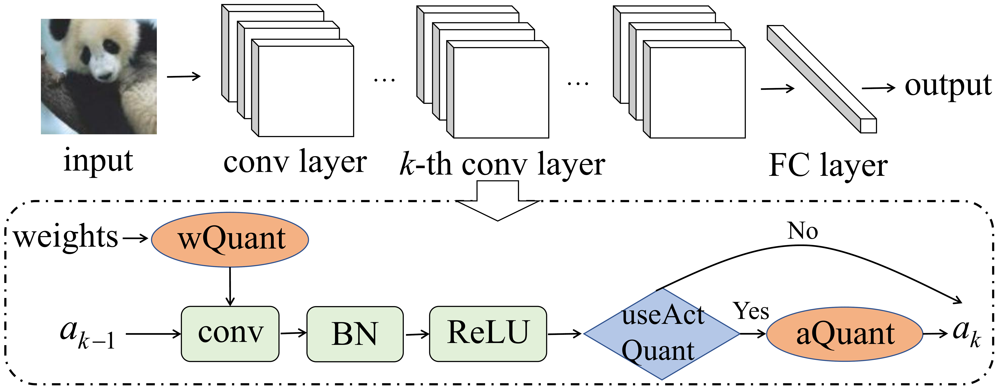

# Quantization Aware Attack

This repository contains code to reproduce results from the paper:

[Quantization Aware Attack: Enhancing the Transferability of Adversarial Attacks across Target Models with Different Quantization Bitwidths](https://arxiv.org/abs/2305.05875) (TIFS 2024)

Quantized neural networks (QNNs) have received increasing attention in resource-constrained scenarios due to their exceptional generalizability. However, their robustness against realistic black-box adversarial attacks has not been extensively studied.
In this scenario, adversarial transferability is pursued across QNNs with different quantization bitwidths, which particularly involve unknown architectures and defense methods. Previous studies claim that transferability is difficult to achieve across QNNs with different bitwidths on the condition that they share the same architecture.
However, we discover that under different architectures, transferability can be largely improved by using a QNN quantized with an extremely low bitwidth as the substitute model. We further improve the attack transferability by proposing quantization aware attack (QAA), which fine-tunes a QNN substitute model with a multiple-bitwidth training objective.
In particular, we demonstrate that QAA addresses the two issues that are commonly known to hinder transferability: 1) quantization shifts and 2) gradient misalignments.
Extensive experimental results validate the high transferability of the QAA to diverse target models.
For instance, when adopting the ResNet-34 substitute model on ImageNet, QAA outperforms the current best attack in attacking standardly trained DNNs, adversarially trained DNNs, and QNNs with varied bitwidths by 4.3\%~20.9\%, 8.7\%~15.5\%, and 2.6\%~31.1\% (absolute), respectively.
In addition, QAA is efficient since it only takes one epoch for fine-tuning.
In the end, we empirically explain the effectiveness of QAA from the view of the loss landscape. 



## Requirements

+ Python >= 3.8.0
+ torch >= 1.10.2
+ torchvision >= 0.11.3
+ numpy >= 1.20.3
+ pandas >= 1.4.1
+ PIL >= 9.3.0
+ robustbench
+ tqdm >= 4.62.3


## ImageNet

### Prepare the data and models

Please download the [data](https://drive.google.com/drive/folders/1CfobY6i8BfqfWPHL31FKFDipNjqWwAhS) and [pretrained models](https://drive.google.com/file/d/1Oj4-IrZMPDhY-tXmDfmdegBFJPbzplCr/view?usp=drive_link), unzip the file and place the data and pretrained models under ./ImageNet/. The directory should be like:

```
ImageNet
+-- val_rs
+-- val_rs.csv
+-- checkpoints_ImageNet
```

### Running the attack

Enter the ImageNet directory:

```
cd ./ImageNet
```

Train the QAA substitute model:
```
python -m torch.distributed.launch --nproc_per_node=6 train.py --data /data/yyl/data/ImageNet/ --stochastic 1 --ckpt_id 120603
```

Generate adversarial examples with the QAA substitute model and the MI-FGSM attack:
```
python attack.py --data_source /data/yyl/data/ImageNet/val_rs --arch resnet34 --attack admix --w_bit 2 --a_bit 2 --quantize_method apot --stochastic 1 --ckpt_id 120603 --device 0
```

Evaluate the attack success rates on Inception_v3 target model:
```
python evaluate.py --arch inception_v3 --output_dir ./adv_imgs/apot/resnet34_w2a2_stochastic/admix --device 0
```


## CIFAR-10

### Prepare the data and models

Please download the [pretrained models](https://drive.google.com/file/d/1Oj4-IrZMPDhY-tXmDfmdegBFJPbzplCr/view?usp=drive_link) and place them under ./ImageNet/, respectively. The CIFAR-10 dataset will be downloaded automatically when running the code. The directory structure should be like:

```
CIFAR-10
+-- checkpoints_CIFAR-10
```

### Running the attack

Enter the CIFAR-10 directory:

```
cd ./CIFAR-10
```

Train the QAA substitute model:
```
python train.py --stochastic 1 --ckpt_id 120603 --device 0 
```

Generate adversarial examples with the QAA substitute model and the MI-FGSM attack:
```
python attack.py --attack pgd --arch resnet56 --w_bit 2 --a_bit 2 --quantize_method apot --ckpt_name 120603 --stochastic 1 --device 0
```

Or you can run the following script to evaluate on multiple target models:
```
bash ./fp_benchmark.sh
```

## Acknowledgments
Our code refers to:

[VT](https://github.com/JHL-HUST/VT)

[QDrop](https://github.com/wimh966/QDrop)

[APoT_Quantization](https://github.com/yhhhli/APoT_Quantization)

[PyTorch_CIFAR10](https://github.com/huyvnphan/PyTorch_CIFAR10)


## About us
We are in XJTU-AISEC lab led by [Prof. Chao Shen](https://gr.xjtu.edu.cn/en/web/cshen/home), [Prof. Chenhao Lin](https://gr.xjtu.edu.cn/en/web/linchenhao), [Prof. Zhengyu Zhao](https://zhengyuzhao.github.io/), Prof. Qian Li, and etc. in the School of Cyber Science and Engineering, Xi'an Jiaotong University.

Please contact Yulong Yang at xjtu2018yyl0808@stu.xjtu.edu.cn if you have any question on the codes. If you find this repository useful, please consider giving ⭐.